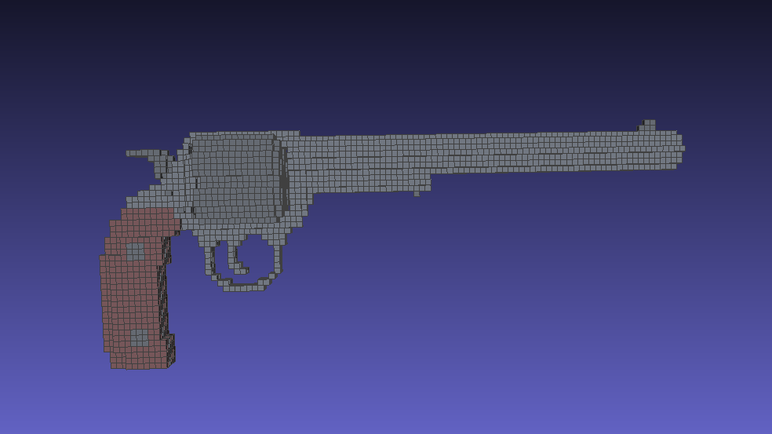

# Projeto Sculptor

## Introdução

Este projeto tem como objetivo criar uma ferramenta que permite a produção de esculturas 3D utilizando programação orientada a objetos em C++.

A ferramenta disponibiliza uma classe chamada `Sculptor`, que possui diversos métodos para desenhar ou apagar formas geométricas em _voxels_ (pequenos cubos) dentro de uma matriz tridimensional. Ao final, o programa gera um arquivo no formato `.off`, que pode ser visualizado em softwares de terceiros, como MeshLab ou GeomView.

## Explicação

Para começar, é necessário criar um objeto da classe `Sculptor`. Esse objeto é inicializado com três parâmetros que definem as dimensões \(x\), \(y\) e \(z\), delimitando o tamanho máximo da matriz tridimensional a ser utilizada: 
```cpp
Sculptor(int nx, int ny, int nz);
```
Os métodos disponíveis são os seguintes:

| Métodos | Parâmetros | Descrição |
| ------ | ------ | ------ |
| `setColor(int r, int g, int b, float a)` | 3 inteiros (0-255) representando as cores RGB e 1 float (0.0-1.0) para a transparência | Define a cor e a transparência dos _voxels_ que serão adicionados a seguir no código. | 
| `putVoxel(int x, int y, int z)` | 3 inteiros representando as coordenadas $x$, $y$ e $z$ | Adiciona um _voxel_ na coordenada especificada. Se já houver um _voxel_ no local, sua cor será atualizada. |
| `cutVoxel(int x, int y, int z)` | 3 inteiros representando as coordenadas $x$, $y$ e $z$ | Remove o _voxel_ na coordenada especificada. |
| `putBox(int x0, int y0, int z0, int x1, int y1, int z1)` | 6 inteiros representando duas coordenadas $x$, $y$ e $z$ | Cria um paralelepípedo que vai da coordenada inicial até a coordenada final. |
| `cutBox(int x0, int y0, int z0, int x1, int y1, int z1)` | 6 inteiros representando duas coordenadas $x$, $y$ e $z$ | Remove o paralelepípedo dentro do intervalo especificado. |
| `putSphere(int xcenter, int ycenter, int zcenter, int radius)` | 4 inteiros: 3 coordenadas $x$, $y$ e $z$ e o raio | Cria uma esfera centrada na coordenada especificada, com o raio fornecido. |
| `cutSphere(int xcenter, int ycenter, int zcenter, int radius)` | 4 inteiros: 3 coordenadas $x$, $y$ e $z$ e o raio | Remove uma esfera centrada na coordenada especificada, com o raio fornecido. |
| `putEllipsoid(int xcenter, int ycenter, int zcenter, int rx, int ry, int rz)` | 6 inteiros: 3 coordenadas $x$, $y$ e $z$ e os raios para os eixos $x$, $y$ e $z$ | Cria um elipsóide centrado na coordenada especificada, com os raios fornecidos para cada eixo. |
| `cutEllipsoid(int xcenter, int ycenter, int zcenter, int rx, int ry, int rz)` | 6 inteiros: 3 coordenadas $x$, $y$ e $z$ e os raios para os eixos $x$, $y$ e $z$ | Remove um elipsóide centrado na coordenada especificada, com os raios fornecidos para cada eixo. |
| `writeOFF(const char* filename)` | Um array de caracteres contendo o nome de um arquivo `.off` | Gera um arquivo `.off` com todas as informações da estrutura criada pelo usuário. Esse arquivo pode ser visualizado em softwares de modelagem 3D. |

## Exemplo

Este repositório inclui um arquivo .off contendo uma escultura de exemplo, além do código no arquivo main.cpp que gerou essa escultura.

A escultura gerada como exemplo é a seguinte:



## Problemas Conhecidos

- Coordenadas fora dos limites do objeto podem causar erros.
- Arquivos `.off` gerados podem não abrir em algumas versões antigas do MeshLab.

## Dependências

Este projeto não depende de bibliotecas externas além do padrão C++ STL. Para visualização, recomenda-se utilizar o MeshLab ou GeomView.
